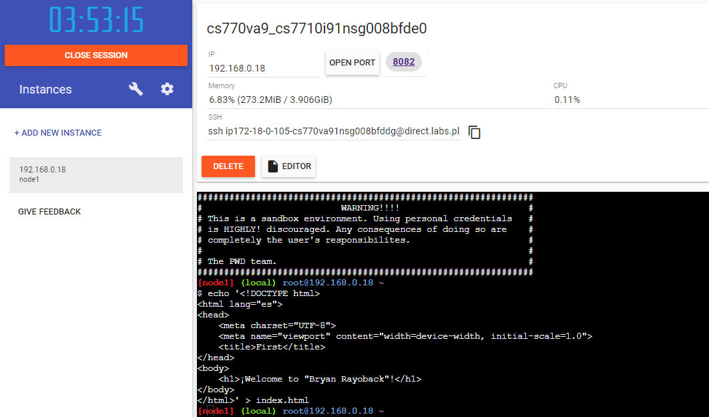
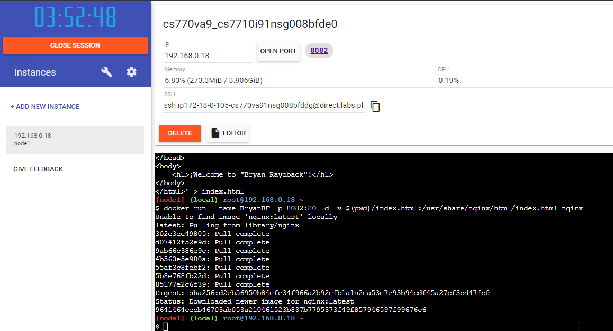
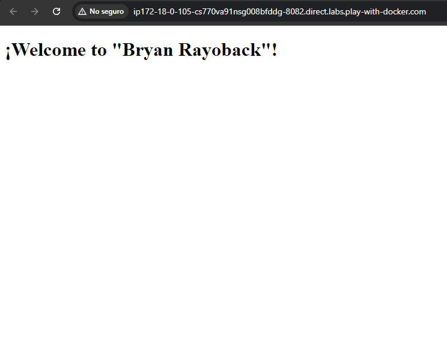

# Practica servidor web
## 1. Titulo
Implementación de un servidor web utilizando Docker y Nginx.
## 2. Tiempo de duración
Me tomé aproximadamente 15 minutos para desarrollar la práctica.

## 3. Fundamentos:

Es fundamental conocer qué es Docker y cómo funciona. Docker es una plataforma que permite crear, implementar y ejecutar aplicaciones en contenedores. Un contenedor es un entorno aislado que empaqueta todo lo necesario para ejecutar una aplicación, incluyendo su código, bibliotecas y dependencias. utilicé Nginx, un servidor web de alto rendimiento, para servir archivos HTML. Aprendí a ejecutar un contenedor de Nginx y a mapear puertos entre mi máquina local y el contenedor. El uso de imágenes de Docker simplifica el proceso de despliegue de aplicaciones, ya que puedo utilizar imágenes preconfiguradas desde Docker Hub.
Utilicé esta funcionalidad para servir un archivo index.html que creé específicamente para la práctica.

## 4. Conocimientos previos.
   
Para realizar esta práctica, el estudiante necesita tener claros los siguientes temas:

Uso de comandos básicos de Docker.
Manejo de un navegador web para acceder al servidor.
Entendimiento de cómo funcionan los contenedores.

- Comandos básicos de Linux (cd, ls, echo, etc.).
- Cómo navegar y manejar archivos desde una terminal.
- Conceptos básicos sobre contenedores y Docker.
- Usar un navegador web para acceder a Docker Playground.

## 5. Objetivos a alcanzar
   
- Implementar contenedores con Nginx para servir contenido web.
- Manipular archivos de configuración de Nginx a través de volúmenes en Docker.

  
## 6. Equipo necesario:
  
- Computador con sistema operativo Windows/Linux/Mac ...
- Cuenta en docker play....
- Docker versión 20.x o superior (si se realiza de forma local).
- etc.

## 7. Material de apoyo.
   
- Documentacion de docker.
- Guia de asignatura.
- Cheat sheet linux
- etc
  
## 8. Procedimiento

### Paso 1: Creación del archivo index.html

En primer lugar, creamos el archivo HTML que será servido por el servidor web Nginx. El comando echo se utilizó para generar el contenido del archivo index.html, que contiene una estructura básica de HTML:

echo '<!DOCTYPE html>
<html lang="es">
<head>
    <meta charset="UTF-8">
    <meta name="viewport" content="width=device-width, initial-scale=1.0">
    <title>First</title>
</head>
<body>
    <h1>¡Welcome to "Bryan Rayoback"!</h1>   
</body>                                                            
</html>' > index.html

 Este comando crea un archivo llamado index.html con el contenido de una página web muy simple, que muestra un encabezado con el mensaje "¡Welcome to 'Bryan Rayoback'!". Este archivo será utilizado por Nginx para mostrar una página web cuando accedamos al servidor.

### Paso 2: Creación y ejecución del contenedor Nginx

Ejecutamos el siguiente comando de Docker para crear y correr un contenedor de Nginx, que servirá el archivo index.html que acabamos de crear:

docker run --name BryanBF -p 8082:80 -d -v $(pwd)/index.html:/usr/share/nginx/html/index.html nginx

Explicación del comando:

docker run: Este comando se usa para ejecutar un contenedor.

--name BryanBF: Se asigna el nombre BryanBF al contenedor.

-p 8082:80: Mapea el puerto 8082 de la máquina local al puerto 80 del contenedor, lo que nos permitirá acceder al servidor web de Nginx desde el puerto 8082 de nuestro navegador local.

-d: Ejecuta el contenedor en modo detached (en segundo plano).

-v $(pwd)/index.html:/usr/share/nginx/html/index.html: Monta el archivo index.html de la máquina local dentro del contenedor, en la ruta /usr/share/nginx/html/index.html, que es el directorio predeterminado de Nginx para servir archivos HTML.

nginx: Especifica que estamos utilizando la imagen de Docker de Nginx.

## 9. Resultados esperados:
    

Aquí hay algunas imágenes que ilustran el trabajo realizado.

# Informe

Aquí está la primera imagen:

Aquí está la segunda imagen:

Aquí está la tercera imagen:

## 10. Bibliografía
    
Docker, Inc. (2021). Docker Documentation. https://docs.docker.com/

Apellido, Nombre. Título del libro. Editorial, Año.